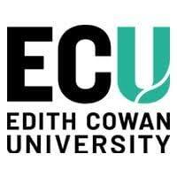

  <h3>Proudly supported by:</h3>
  

    
    
  

ToM4AI is a full, one-day workshop, Monday 26/01/2026 - Singapore EXPO [Garnet Room 213]

## 📅 Workshop Schedule

<table style="width: 100%; border-collapse: collapse; font-family: 'Segoe UI', Tahoma, Geneva, Verdana, sans-serif; color: #000000;">
<thead>
<tr style="background: linear-gradient(135deg, #007bff 0%, #0056b3 100%); color: white;">
<th style="padding: 15px 20px; text-align: left; font-weight: 600; border-radius: 8px 0 0 0;">🕐 Time</th>
<th style="padding: 15px 20px; text-align: left; font-weight: 600; border-radius: 0 8px 0 0;">📋 Session</th>
</tr>
</thead>
<tbody>
<tr style="background: rgba(255,255,255,0.8); border-bottom: 1px solid #dee2e6;">
<td style="padding: 12px 20px; font-weight: 500;">08:30 - 09:00</td>
<td style="padding: 12px 20px;">☕ <strong>Gathering</strong></td>
</tr>
<tr style="background: rgba(248,249,250,0.8); border-bottom: 1px solid #dee2e6;">
<td style="padding: 12px 20px; font-weight: 500;">09:00 - 10:00</td>
<td style="padding: 12px 20px;">🎤 <strong>Keynote:</strong> <a href="https://maartensap.com/" target="_blank" style="color: #007bff; text-decoration: none;">Prof. Maarten Sap (CMU)</a></td>
</tr>
<tr style="background: rgba(255,255,255,0.8); border-bottom: 1px solid #dee2e6;">
<td style="padding: 12px 20px; font-weight: 500;">10:05 - 10:30</td>
<td style="padding: 12px 20px;">📊 <strong><a href="/AAAI2026/posters/" style="color: #007bff; text-decoration: none;">Poster Session I</a></strong> <small>(Set A: Human & Cognitive Aspects)</small></td>
</tr>
<tr style="background: rgba(248,249,250,0.8); border-bottom: 1px solid #dee2e6;">
<td style="padding: 12px 20px; font-weight: 500;">10:30 - 11:00</td>
<td style="padding: 12px 20px;">☕ <strong>Coffee Break & Networking</strong></td>
</tr>
<tr style="background: rgba(255,255,255,0.8); border-bottom: 1px solid #dee2e6;">
<td style="padding: 12px 20px; font-weight: 500;">11:00 - 12:00</td>
<td style="padding: 12px 20px;">🎤 <strong>Keynote:</strong> <a href="https://www.psy.ox.ac.uk/people/geoffrey-bird" target="_blank" style="color: #007bff; text-decoration: none;">Prof. Geoff Bird (Oxford)</a> <em>— ECU funded speaker</em></td>
</tr>
<tr style="background: rgba(248,249,250,0.8); border-bottom: 1px solid #dee2e6;">
<td style="padding: 12px 20px; font-weight: 500;">12:00 - 12:30</td>
<td style="padding: 12px 20px;">📊 <strong><a href="/AAAI2026/posters/" style="color: #007bff; text-decoration: none;">Poster Session II</a></strong> <small>(Set B: Computational Agents & Systems)</small></td>
</tr>
<tr style="background: rgba(255,255,255,0.8); border-bottom: 1px solid #dee2e6;">
<td style="padding: 12px 20px; font-weight: 500;">12:30 - 14:00</td>
<td style="padding: 12px 20px;">🍽️ <strong>Lunch Break</strong></td>
</tr>
<tr style="background: rgba(248,249,250,0.8); border-bottom: 1px solid #dee2e6;">
<td style="padding: 12px 20px; font-weight: 500;">14:00 - 15:00</td>
<td style="padding: 12px 20px;">🎤 <strong>Keynote:</strong> <a href="https://u.cs.biu.ac.il/~sarit/" target="_blank" style="color: #007bff; text-decoration: none;">Prof. Sarit Kraus (BIU)</a></td>
</tr>
<tr style="background: rgba(255,255,255,0.8); border-bottom: 1px solid #dee2e6;">
<td style="padding: 12px 20px; font-weight: 500;">15:00 - 16:00</td>
<td style="padding: 12px 20px;">💻 <strong>Collaborative ToM 'Hackathon'</strong></td>
</tr>
<tr style="background: rgba(248,249,250,0.8); border-bottom: 1px solid #dee2e6;">
<td style="padding: 12px 20px; font-weight: 500;">16:00 - 16:30</td>
<td style="padding: 12px 20px;">☕ <strong>Coffee Break</strong></td>
</tr>
<tr style="background: rgba(255,255,255,0.8); border-bottom: 1px solid #dee2e6;">
<td style="padding: 12px 20px; font-weight: 500;">16:30 - 17:30</td>
<td style="padding: 12px 20px;">✨ <strong>Spotlight Papers</strong></td>
</tr>
<tr style="background: rgba(248,249,250,0.8); border-bottom: 1px solid #dee2e6;">
<td style="padding: 12px 20px; font-weight: 500;">17:30 - 17:45</td>
<td style="padding: 12px 20px;">🎯 <strong>Closing Remarks</strong></td>
</tr>
<tr style="background: rgba(255,255,255,0.8);">
<td style="padding: 12px 20px; font-weight: 500;">17:45 - late</td>
<td style="padding: 12px 20px;">🎉 <strong>ToM4AI Social</strong> <em>(Location Tapout Craft Beers, 103 E Coast Rd, Singapore 428797 [Optional])</em></td>
</tr>
</tbody>
</table>

